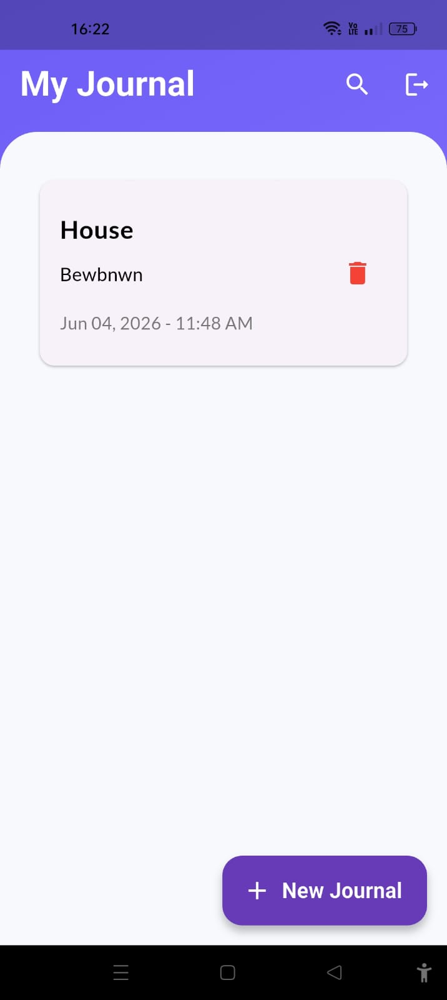

# Zournel

A Flutter-based journal application that allows users to securely create, edit, and manage personal journal entries using Firebase services.

## Features

* User authentication using Firebase Authentication  
* Create journal entries with title and description  
* Edit existing journal entries  
* Delete journal entries  
* Cloud data storage using Firebase Firestore  
* Responsive and user-friendly Flutter UI  

## Tech Stack

* Flutter  
* Dart  
* Firebase Authentication  
* Cloud Firestore  

## Screenshots

<p align="center">
  
  
</p>

<p align="center">
  
  
</p>
## Installation

1. Clone the repository:

```bash
git clone https://github.com/shiyascholayil/zournel.git